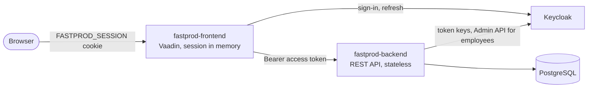

# Architecture

## Two applications

| Application                                           | What it is                                                                        |
|-------------------------------------------------------|-----------------------------------------------------------------------------------|
| [`fastprod-frontend`](../fastprod-frontend/README.md) | a Vaadin Flow application: the UI, rendered on the server, and the user's session |
| [`fastprod-backend`](../fastprod-backend/README.md)   | a stateless REST API that owns the data                                           |

The browser talks only to the front-end. The front-end calls the back-end over HTTP with the signed-in user's access
token (`BaseHttpService`), and the back-end authorizes every call by that token alone. Both check access: a Vaadin
route refuses the navigation, and the back-end refuses the call, so hiding a button is never the only guard.

## Errors and translations

The back-end answers every refusal with a message key, and the front-end renders it from the back-end's catalog: [Error
responses](mechanisms/error-responses.md).
