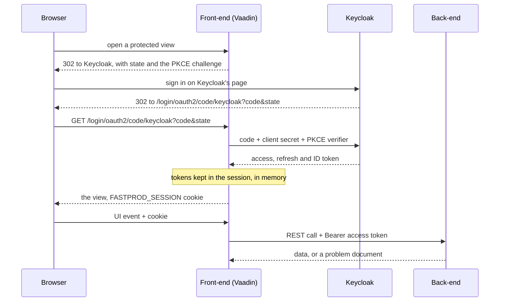

# Authentication

The application never handles a credential. Keycloak (realm `fastprod`) owns every page that touches one: sign-up,
sign-in, email verification, password reset, two-factor authentication and acceptance of the terms of use. The Vaadin
front-end is a BFF: it signs the user in, keeps the tokens in its server-side session and gives the browser only a
session cookie.

## Signing in

1. An anonymous user who opens a protected view, or chooses to sign in, goes to `/oauth2/authorization/keycloak`.
   `LocalizedAuthorizationRequestResolver` builds the authorization request with PKCE, passes the language picked in the
   application (`pl` unless `en` was chosen), and adds `prompt=create` for the sign-up button.
2. Keycloak returns to `/login/oauth2/code/keycloak`. Spring Security exchanges the code, using the confidential client
   `fastprod-frontend` and its secret, and keeps the tokens in the HTTP session.
3. `KeycloakOidcUserService` takes the realm roles from the access token, so Vaadin's `@RolesAllowed` and the menu see
   `ADMIN`, `MANAGER`, `EMPLOYEE` and `USER` as Keycloak grants them.

The browser holds only the `FASTPROD_SESSION` cookie: `HttpOnly`, `SameSite=Lax`, `Secure` outside the local profile.
Vaadin protects every request against CSRF on its own.

## Calls to the back-end

The front-end calls the back-end with `Authorization: Bearer` and the session's access token (`AuthTokenProvider`,
used by `BaseHttpService`). The back-end is a stateless OAuth2 resource server: it verifies the signature against
Keycloak's published keys, the issuer, the expiry and the audience (`fastprod-api`), and takes the roles from
`realm_access.roles`. It creates no session, so every call is authorized by the token alone and any instance can serve
it.

## The session and refreshing

The session lives in the front-end's memory, and its access token is refreshed once per refresh token: [Token
refresh](../fastprod-frontend/docs/mechanisms/token-refresh.md).

## Signing out

Signing out ends the local session and sends the browser to Keycloak's end-session endpoint, which ends the Keycloak
session and returns to the application's home page.

## Code

| Class                                                       | Role                                               |
|-------------------------------------------------------------|----------------------------------------------------|
| `fastprod-frontend/.../shared/security/SecurityConfig`      | the OAuth2 login, Vaadin's security and the client |
| `.../shared/security/LocalizedAuthorizationRequestResolver` | PKCE, language and sign-up                         |
| `.../shared/security/KeycloakOidcUserService`               | the roles read from the access token               |
| `.../shared/security/AuthTokenProvider`                     | the access token for back-end calls, refreshed     |
| `.../shared/security/SingleFlightRefreshTokenProvider`      | one refresh per refresh token                      |
| `fastprod-backend/modules/security/.../SecurityConfig`      | the resource server and its token checks           |
